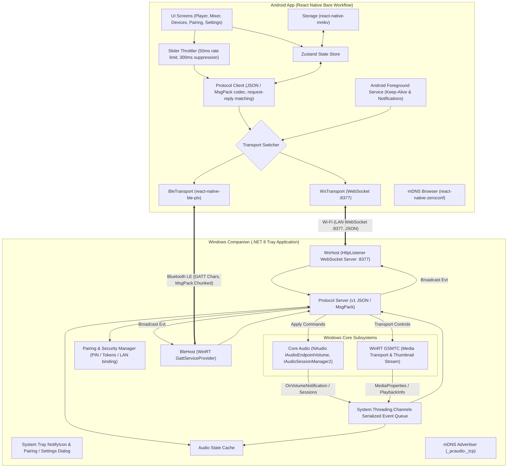
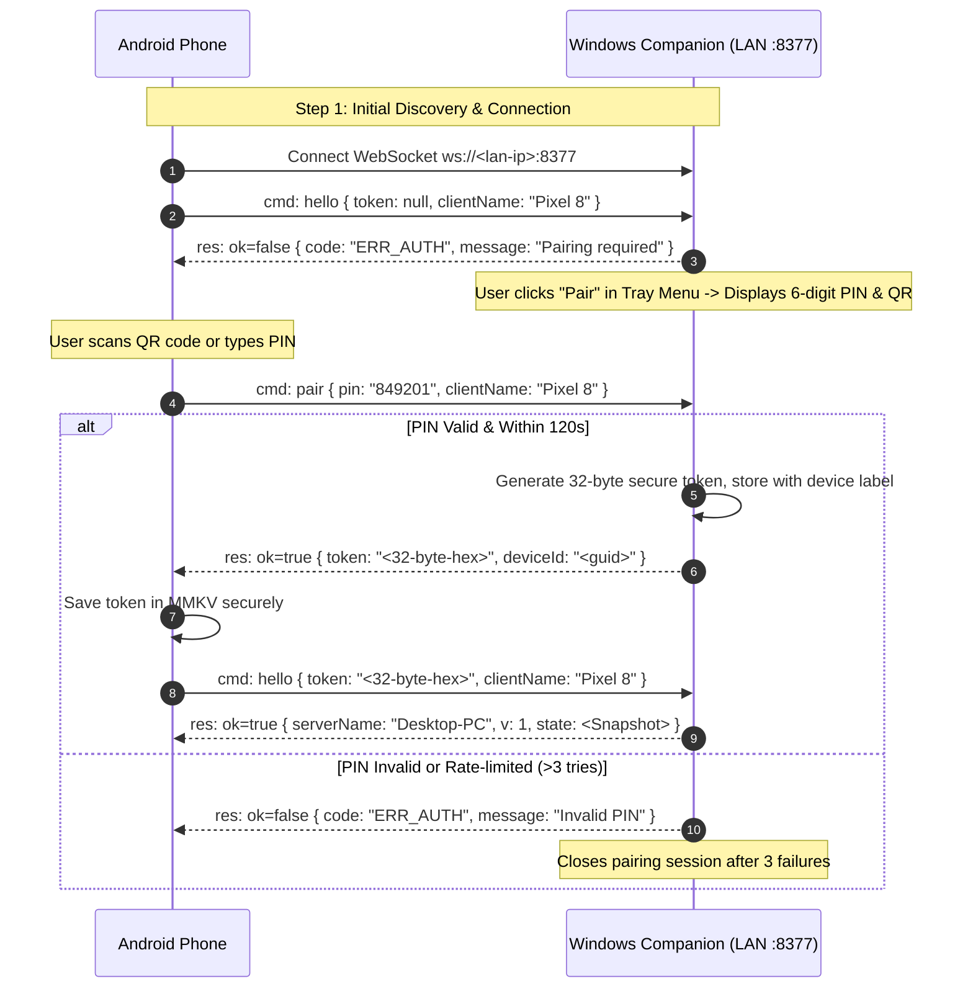

# Windows Audio Remote (Remotva) — Master Implementation Plan

Last updated: 2026-09-19  
Specification reference: [windows-audio-remote-spec.md](file:///D:/Tech%20and%20Development/Coding/remotva/windows-audio-remote-spec.md)

---

## 1. Executive Summary & Goals

**Remotva** is an ultra-low-latency, dual-transport (Wi-Fi WebSocket & Bluetooth LE) Windows audio remote control system comprising:
1. **Windows Companion**: A lightweight .NET 8 tray application (`net8.0-windows10.0.19041.0`) running in background, integrating Windows Core Audio (NAudio) and Windows Runtime GSMTC (Global System Media Transport Controls) with change-driven event dispatching over an async channel.
2. **Android App**: A React Native (TypeScript, bare workflow) client offering optimistic UI, 50ms slider throttling, mDNS / manual discovery, QR / PIN pairing, album art caching, per-app mixer, foreground service keep-alive, and transport fallback.

The companion acts as the **single source of truth**, broadcasting all audio, track, and session changes to keep all connected clients and hardware volume controls synchronized in real-time.

---

## 2. System Architecture & Tech Stack



### Technology Matrix

| Layer / Component | Technology | Rationale & Details |
| --- | --- | --- |
| **Windows Runtime** | .NET 8 (`net8.0-windows10.0.19041.0`) | Modern LTS, high throughput, direct access to WinRT APIs (GSMTC, BLE GATT) |
| **Windows UI** | WPF / WinForms Tray App | Zero overhead tray app, notification icon, custom pairing/settings modal |
| **Windows Audio** | NAudio 2.2+ | Wraps COM interfaces (`IAudioEndpointVolume`, `IAudioSessionManager2`, `ISimpleAudioVolume`) |
| **Windows Media** | `Windows.Media.Control` (GSMTC) | Unified playback control and metadata for Spotify, Chrome, VLC, YouTube, etc. |
| **Windows Networking** | `System.Net.HttpListener` WebSocket + mDNS | Low dependency, high performance, LAN-restricted binding |
| **Android Framework** | React Native 0.74+ (Bare Workflow) | High performance native modules (mDNS, BLE, Camera, MMKV) |
| **Android Discovery** | `react-native-zeroconf` | Discovers `_pcaudio._tcp` services on LAN |
| **Android Bluetooth** | `react-native-ble-plx` | BLE central role, MTU negotiation, characteristic notifications |
| **Android Camera** | `react-native-vision-camera` + barcode scanner | High speed QR code pairing scanner |
| **Android Storage** | `react-native-mmkv` | Synchronous high-speed key-value store for paired device tokens |
| **Android State** | Zustand | Lightweight reactive state management without Redux boilerplate |

---

## 3. Directory & Solution Structure

```
remotva/
├── companion/                      # Windows Companion Solution
│   ├── Remotva.Companion.sln
│   ├── src/
│   │   ├── Remotva.Companion/
│   │   │   ├── Remotva.Companion.csproj
│   │   │   ├── Program.cs          # Application entry point, single instance lock
│   │   │   ├── AppContext.cs       # Tray icon, context menu, lifecycle
│   │   │   ├── Audio/              # Core Audio & Session Management
│   │   │   │   ├── AudioController.cs      # IAudioEndpointVolume wrapper
│   │   │   │   ├── SessionManager.cs       # IAudioSessionManager2 wrapper
│   │   │   │   └── Models/                 # AudioSessionInfo, VolumeState
│   │   │   ├── Media/              # GSMTC & Album Art
│   │   │   │   ├── MediaController.cs      # GSMTC manager & event handlers
│   │   │   │   ├── AlbumArtCache.cs        # 300x300 & 96x96 JPEG encoder/cache
│   │   │   │   └── Models/                 # TrackMetadata, PlayState
│   │   │   ├── Protocol/           # Protocol Engine
│   │   │   │   ├── Messages.cs             # Command, Response, Event models
│   │   │   │   ├── ProtocolEngine.cs       # Request dispatching, validation
│   │   │   │   └── Serialization.cs        # JSON & MessagePack codecs
│   │   │   ├── Security/           # Pairing & Auth
│   │   │   │   ├── PairingManager.cs       # PIN generation, expiration, rate limiting
│   │   │   │   ├── TokenStore.cs           # Persistent client tokens & revocations
│   │   │   │   └── DeviceIdentity.cs       # Stable machine GUID & LAN IP resolver
│   │   │   ├── Transports/         # Transport Hosts
│   │   │   │   ├── ITransportHost.cs
│   │   │   │   ├── WsHost.cs               # HttpListener WebSocket server
│   │   │   │   ├── BleHost.cs              # WinRT GattServiceProvider & chunker
│   │   │   │   └── MdnsAdvertiser.cs       # _pcaudio._tcp announcer
│   │   │   ├── UI/                 # Presentation Windows
│   │   │   │   ├── PairingForm.cs/xaml     # PIN & QR code display
│   │   │   │   └── SettingsForm.cs/xaml    # Paired devices, revoke, port, BLE toggle
│   │   │   └── Utils/
│   │   │       ├── SerializedChannel.cs    # System.Threading.Channels queue
│   │   │       └── FirewallHelper.cs       # Rule check / notification
│   │   └── Remotva.Tests/          # Unit & Integration Tests (.NET)
│   │       ├── ProtocolTests.cs
│   │       ├── PairingTests.cs
│   │       └── SerializationTests.cs
├── mobile/                         # React Native Android Application
│   ├── package.json
│   ├── tsconfig.json
│   ├── android/                    # Native Android project
│   ├── src/
│   │   ├── api/                    # Protocol client & Transports
│   │   │   ├── protocol.ts         # Types, request-reply matching, envelope
│   │   │   ├── transports/
│   │   │   │   ├── ITransport.ts   # Common transport interface
│   │   │   │   ├── WsTransport.ts  # WebSocket transport with exponential backoff
│   │   │   │   └── BleTransport.ts # BLE central, MTU, chunk reassembler
│   │   │   └── discovery/
│   │   │       └── mdns.ts         # ZeroConf service scanner
│   │   ├── store/                  # Zustand state store
│   │   │   ├── useAudioStore.ts    # Master volume, sessions, track, playState
│   │   │   ├── useDeviceStore.ts   # Paired PCs, active connection, tokens
│   │   │   └── useSettingsStore.ts # Preferences, transport preference
│   │   ├── hooks/
│   │   │   ├── useThrottledSlider.ts # 50ms outbound throttle, 300ms inbound suppression
│   │   │   └── useVolumeKeys.ts      # Hardware volume key capture
│   │   ├── screens/
│   │   │   ├── DevicesScreen.tsx   # Discovered & saved PCs, connection status
│   │   │   ├── PairingScreen.tsx   # VisionCamera QR scanner + PIN entry
│   │   │   ├── PlayerScreen.tsx    # Album art, track info, transport, master volume
│   │   │   ├── MixerScreen.tsx     # Per-app audio sliders & mutes
│   │   │   └── SettingsScreen.tsx  # Device management, transport selection
│   │   ├── components/             # Reusable UI widgets
│   │   │   ├── VolumeSlider.tsx    # Smooth drag slider with optimistic update
│   │   │   ├── AppIcon.tsx         # App icon placeholder / resolver
│   │   │   └── ConnectionBanner.tsx# Dimmed reconnecting banner
│   │   └── services/
│   │       └── ForegroundService.ts# Android keep-alive service & lockscreen controls
├── tools/                          # Test scripts & Harnesses
│   ├── test-client.js              # Node.js WebSocket test client for Milestone 1
│   ├── simulate-events.ps1         # Windows script to test volume/media changes
│   └── mock-companion.js           # Mock WebSocket companion for mobile UI tests
├── installer/                      # Windows Companion Packaging
│   ├── InnoSetup/
│   │   └── remotva-setup.iss       # Inno Setup script with auto firewall rule
│   └── scripts/
│       └── add-firewall-rule.ps1
├── PLAN.md                         # This implementation plan
├── PROGRESS.md                     # Live task tracking & milestone checklist
└── windows-audio-remote-spec.md    # Master specification
```

---

## 4. Detailed Milestone & Build Plan

### Milestone 1: Windows Companion Core (No Phone Involved)
**Goal**: Build the headless/tray .NET 8 application with Core Audio volume/mute, GSMTC media transport controls, WebSocket server on port 8377, pairing & token authentication, and event broadcasting. Verify completely via a Node.js CLI test client.

#### Deliverables:
1. **.NET 8 Project Setup**: Target `net8.0-windows10.0.19041.0`, add NAudio, System.Threading.Channels, and ZXing.NET (for QR code generation).
2. **Audio Controller (`Audio/AudioController.cs`)**:
   - Wrap `MMDeviceEnumerator` and default multimedia endpoint `IAudioEndpointVolume`.
   - Register `AudioEndpointVolumeCallback` for `OnVolumeNotification`.
   - Implement `GetMasterVolume()`, `SetMasterVolume(float level)`, `SetMute(bool muted)`, `AdjustVolume(float delta)`.
3. **Media Transport Controller (`Media/MediaController.cs`)**:
   - Access `GlobalSystemMediaTransportControlsSessionManager`.
   - Hook `CurrentSessionChanged`, `PlaybackInfoChanged`, `MediaPropertiesChanged`.
   - Implement `PlayAsync()`, `PauseAsync()`, `TogglePlayPauseAsync()`, `NextAsync()`, `PreviousAsync()`.
   - Extract title, artist, album, duration, position, playState, and generate `trackId` (SHA256 hash of `title + artist`).
4. **Album Art Processor (`Media/AlbumArtCache.cs`)**:
   - Fetch thumbnail `IRandomAccessStreamWithContentType` from GSMTC.
   - Resize to 300×300 (and 96×96 for BLE), encode as JPEG at quality 80.
   - Cache in-memory keyed by `trackId`, return Base64 on `getAlbumArt`.
5. **Serialized Event Channel (`Utils/SerializedChannel.cs`)**:
   - Create single-reader `Channel<AudioEvent>(Unbounded)` to marshal all COM and WinRT callbacks into a single thread-safe sequence before touching state or network.
6. **Pairing & Security Manager (`Security/PairingManager.cs` & `TokenStore.cs`)**:
   - Generate secure 6-digit PIN with 120s TTL and 3-attempt limit.
   - Store device tokens (32 random bytes cryptographically generated) in encrypted local configuration.
   - Validate `hello` within 5 seconds of connection; reject unauthorized requests with `ERR_AUTH`.
7. **WebSocket Server (`Transports/WsHost.cs`)**:
   - Use `HttpListener` bound specifically to LAN IP address on port 8377 (`http://<lan-ip>:8377/`).
   - Frame and dispatch JSON protocol messages (`cmd`, `res`, `evt`).
   - Broadcast events to all authenticated active connections.
8. **Tray UI & Pairing Dialog (`AppContext.cs` & `UI/PairingForm.cs`)**:
   - Tray icon with menu: "Status: Ready", "Pair New Device...", "Settings...", "Exit".
   - Pairing Form displays 6-digit PIN and QR code containing JSON `{ ip, port, pin, id, name }`.
9. **Verification Harness (`tools/test-client.js`)**:
   - Node.js script connecting to `ws://<lan-ip>:8377`.
   - Tests unauthenticated rejection, pairing flow with PIN, token persistence, `setVolume`, `setMute`, `adjustVolume`, media controls, and verifies incoming `volumeChanged` and `trackChanged` events.

---

### Milestone 2: Android App Foundation & Wi-Fi Client
**Goal**: Build the React Native bare workflow Android app, establish Wi-Fi discovery & pairing, and deliver the Player tab with synchronized real-time controls and resilient reconnection.

#### Deliverables:
1. **React Native Initialization**:
   - Bare workflow with TypeScript (`mobile/`).
   - Install dependencies: `zustand`, `react-native-mmkv`, `react-native-zeroconf`, `react-native-vision-camera`, `react-native-safe-area-context`, `@react-navigation/native`, `@react-navigation/bottom-tabs`.
2. **mDNS Discovery (`src/api/discovery/mdns.ts`)**:
   - Announce and browse for `_pcaudio._tcp`.
   - Parse TXT records (`name`, `ver`, `id`).
   - Fallback to manual IP entry and cache last known IP in MMKV.
3. **Protocol Client & WsTransport (`src/api/protocol.ts` & `WsTransport.ts`)**:
   - Manage WebSocket connection with exponential backoff (500ms to 10s).
   - Enforce 5s auth handshake timeout.
   - Request-response matching via `id` correlation table with timeouts.
   - Push incoming events into Zustand store.
4. **Slider Throttling & Optimistic UI (`src/hooks/useThrottledSlider.ts`)**:
   - Throttle outbound `setVolume` to max once per 50ms while dragging.
   - Always dispatch final value on touch release.
   - Inbound event suppression window: ignore `volumeChanged` for 300ms while user actively drags to eliminate slider jitter.
5. **Screens**:
   - **Devices Screen**: List discovered PCs, saved PCs with connection status, "Add Manually" option, and "Pair" trigger.
   - **Pairing Screen**: Camera QR code scanner using VisionCamera + fallback manual 6-digit PIN input.
   - **Player Screen**: Album art card, track title, artist, playback controls (prev/play/next), master volume slider, mute toggle.
   - **Settings Screen**: Reconnect behavior, forget paired PC, transport preference.
6. **Reconnection UX**:
   - Keep last known state on screen, dimmed with controls disabled, showing a top banner "Reconnecting...". Do not abruptly eject user to device list.

---

### Milestone 3: Now Playing & Album Art Integration
**Goal**: Deep GSMTC integration with real-time metadata syncing, album art caching, and background playback tracking.

#### Deliverables:
1. **GSMTC Event Pipeline (Windows)**:
   - Handle edge cases: player closure, no active media session, player switching (e.g. from Spotify to Chrome).
   - Emit `trackChanged` (`trackId`, `title`, `artist`, `album`, `hasArt`, `duration`).
   - Emit `playStateChanged` (`playState`: playing, paused, stopped; `position`).
2. **On-Demand Album Art Architecture**:
   - Companion does not push art automatically in `trackChanged` (saves network bandwidth).
   - Android client inspects `hasArt`, checks local memory/disk cache for `trackId`. If missing, issues `getAlbumArt` with `maxSize: 300`.
   - Companion fetches GSMTC thumbnail, resizes, compresses to JPEG 80, caches, and responds with Base64.
3. **Foreground Service (`services/ForegroundService.ts`)**:
   - Implement Android Foreground Service to prevent Android Doze mode from killing the WebSocket.
   - Render Android notification with current track, artist, play/pause action, and PC volume.

---

### Milestone 4: Per-App Audio Mixer
**Goal**: Full per-session audio control on Windows via Core Audio session enumeration, live tracking of app audio creation/destruction, and a fluid Mixer tab on Android.

#### Deliverables:
1. **Core Audio Session Manager (`Audio/SessionManager.cs`)**:
   - Wrap `IAudioSessionManager2` to enumerate active sessions.
   - Filter out system sounds and inactive sessions if needed.
   - Extract Process ID (`sessionId`), Process Name (e.g., "Spotify.exe" -> "Spotify"), master volume (`ISimpleAudioVolume`), and mute state.
   - Subscribe to `IAudioSessionNotification` to detect when apps start or stop producing audio.
   - Subscribe to `IAudioSessionEvents` per session to capture external volume changes.
2. **Companion Protocol Handlers**:
   - `getSessions` command returns complete `sessions[]` list.
   - `setSessionVolume(sessionId, level)` sets process audio level.
   - `setSessionMute(sessionId, muted)` toggles process mute.
   - `sessionsChanged` event pushes updated full array (since PIDs are transient).
   - `sessionVolumeChanged` pushes single session update for minimal wire traffic.
3. **Android Mixer Screen (`src/screens/MixerScreen.tsx`)**:
   - Virtualized list showing one row per active audio session:
     - Process name and icon placeholder.
     - Individual volume slider with 50ms throttling.
     - Individual mute toggle.
   - Smooth list updates keyed by process name / session ID without flickering.

---

### Milestone 5: Bluetooth Low Energy (BLE) Transport
**Goal**: Full offline/Wi-Fi-independent control over BLE GATT. Windows acts as BLE Peripheral, Android as Central, sharing the exact same protocol.

#### Deliverables:
1. **Windows BLE Peripheral (`Transports/BleHost.cs`)**:
   - Use WinRT `Windows.Devices.Bluetooth.GenericAttributeProfile.GattServiceProvider`.
   - Advertise custom Remotva Service UUID.
   - Setup Characteristics:
     - **Command Characteristic**: Write without response / Write (Phone -> PC).
     - **Event Characteristic**: Notify (PC -> Phone).
     - **Control Characteristic**: Read (Protocol version, device ID, negotiated MTU).
2. **MessagePack & Chunking Protocol**:
   - Encode protocol payload with MessagePack.
   - Chunk packets exceeding MTU (typically ~185 bytes):
     - 3-byte header: `[Byte 0: MessageId, Byte 1: ChunkIndex, Byte 2: ChunkCount]`.
     - 5-second reassembly buffer on receiver; drop incomplete messages on timeout.
3. **BLE Bandwidth Adaptations**:
   - Restrict mixer payload on BLE to active audio sessions only.
   - Enforce 96×96 thumbnail cap or return `ERR_TOO_LARGE` (>8 KB).
4. **Android BLE Central (`src/api/transports/BleTransport.ts`)**:
   - Integrate `react-native-ble-plx`.
   - Android 12+ runtime permission handling (`BLUETOOTH_SCAN`, `BLUETOOTH_CONNECT`, fine location).
   - Chunk reassembler and sender.
5. **Transport Switcher (`src/api/transports/TransportManager.ts`)**:
   - Automatic fallback: Saved IP -> mDNS (3s timeout) -> BLE.
   - Manual override toggle in Settings ("Prefer Wi-Fi" vs "Prefer Bluetooth").

---

### Milestone 6: Packaging, Installer & Hardening
**Goal**: Production-ready deployment artifacts for Windows and Android.

#### Deliverables:
1. **Windows Firewall Rule Automation**:
   - Automatic inbound rule creation for port 8377 TCP during install (`netsh advfirewall firewall add rule name="Remotva Companion" dir=in action=allow protocol=TCP localport=8377`).
   - Startup check in companion to detect Public network category and prompt user if blocked.
2. **Inno Setup Installer**:
   - Build single executable installer for Companion.
   - Install as Windows startup item (Registry `HKCU\Software\Microsoft\Windows\CurrentVersion\Run`).
   - Bundles .NET 8 runtime check / self-contained deployment.
3. **Android Release APK**:
   - Proguard rules, signed release APK, release bundle configuration.

---

## 5. Security & Pairing Specification



### Key Security Safeguards:
1. **LAN Binding Only**: HttpListener binds exclusively to detected LAN adapters (e.g. `192.168.x.x` or `10.x.x.x`), rejecting external WAN traffic.
2. **Handshake Timeout**: Any client failing to authenticate within 5 seconds of opening the socket is disconnected.
3. **Revocation**: Companion Settings dialog lists all active paired device tokens with a "Revoke" button to invalidate compromised tokens immediately.
4. **No Cloud / No External Relay**: Zero dependency on external servers or relays; total privacy on local network.

---

## 6. Verification & Testing Strategy

### Milestone-by-Milestone Verification Plan

| Milestone | Test Type | Verification Method & Expected Result |
| --- | --- | --- |
| **M1: Companion Core** | Automated & Scripted | Run `node tools/test-client.js`. Verify: (1) Unauthenticated hello fails with `ERR_AUTH`; (2) Pairing with PIN succeeds and issues token; (3) `setVolume` adjusts Windows speaker slider; (4) Hardware volume key nudge generates `volumeChanged` event back to Node client. |
| **M2: Android Wi-Fi** | Manual & UI | Launch Android app on phone. Scan QR code from Companion. Drag volume slider: PC volume moves smoothly with ≤50ms latency. Press physical volume buttons on PC: slider on phone stays in sync. Disconnect PC Wi-Fi: phone displays dimmed reconnecting state, automatically recovers upon Wi-Fi reconnect. |
| **M3: Media & Art** | End-to-End | Play track in Spotify/YouTube. Verify track title, artist, duration appear on phone within 1s. Verify album art displays correctly. Tap Next/Pause: media reacts instantly. |
| **M4: Audio Mixer** | Dynamic Audio Sessions | Open Chrome and start YouTube audio. Chrome row appears in Android Mixer tab. Adjust Chrome slider: only Chrome audio level changes. Close tab: row disappears within 1s. |
| **M5: Bluetooth LE** | Transport Fallback | Disable Wi-Fi on Android phone. App transitions to BLE mode within 3s. Master volume and playback controls continue working reliably over BLE. |
| **M6: Installer & Package**| OS Validation | Run Inno Setup installer on clean Windows machine. Verify tray icon launches, firewall rule is active without prompt, companion starts on login. |

---

## 7. Risk Management & Mitigations

1. **Windows Firewall Blocking Discovery**:
   - *Mitigation*: Inno Setup script executes `netsh advfirewall` command. Companion startup logic inspects active network category and presents an alert if connected via "Public" network.
2. **Android Multicast/mDNS Router Drops**:
   - *Mitigation*: Provide explicit manual IP entry on Android, and persistently cache the last successful IP and device ID in MMKV for instant direct reconnects.
3. **Audio Slider Fighting Finger (Jitter)**:
   - *Mitigation*: Implement 50ms outbound throttling and 300ms inbound suppression window during active drag gestures.
4. **Android Doze Killing WebSockets in Background**:
   - *Mitigation*: Run an Android Foreground Service with ongoing notification when connected.
5. **Transient Audio Session IDs**:
   - *Mitigation*: Treat PIDs as transient; broadcast full session list on session changes; correlate UI list keys smoothly by process name/app identifier.
6. **BLE MTU & Throughput Bottlenecks**:
   - *Mitigation*: Implement 3-byte chunking protocol, MessagePack compression, and throttle BLE mixer to active-only sessions.
