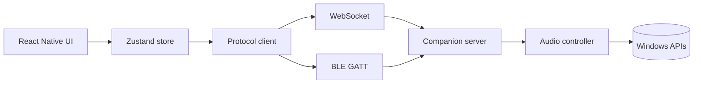
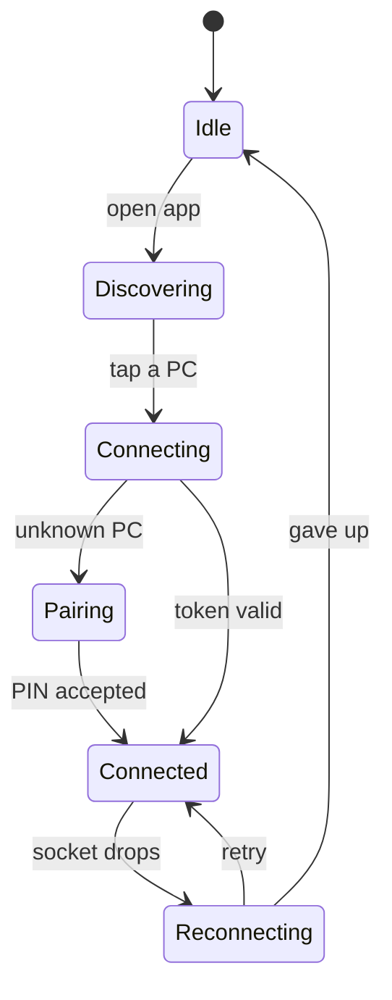
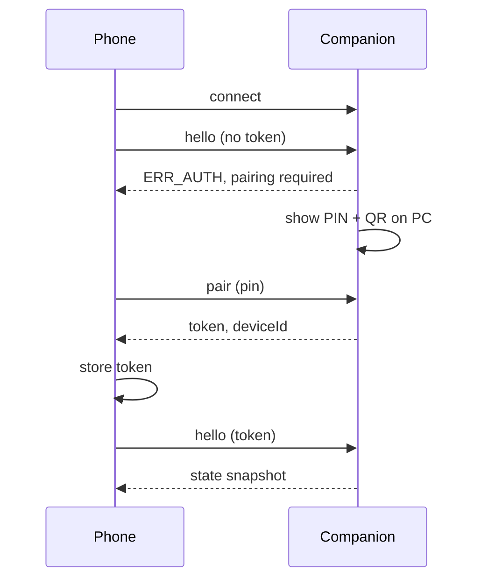

# Windows Audio Remote — Architecture & Protocol Spec

Last updated: 2026-09-19

Android app + Windows companion for controlling PC audio over Wi-Fi or Bluetooth.

## System overview

The system is two programs that speak one protocol over two possible transports.

The **Android app** is a thin client. It holds no audio logic at all — it renders whatever state the PC reports and sends commands when you touch something. The **Windows companion** owns everything real: it reads the current volume, enumerates apps making sound, watches the active media player, and applies incoming commands.

A volume drag travels like this. Your finger moves the slider, the app updates its own slider position immediately so it feels instant, and sends a `setVolume` command at most every 50 ms while dragging. The companion receives it, calls the Windows Core Audio API, and the speaker level changes. The companion then broadcasts a `volumeChanged` event to every connected phone, including yours — which is how a second phone, or the PC's own volume keys, stays in sync.

That last point is the design rule worth stating once: **the PC is the single source of truth.** The phone never assumes a command succeeded. It shows optimistic UI for smoothness, but the companion's events are what the state actually is.

## Architecture



Both ends have the same shape: a UI or API layer, a protocol layer that knows the message catalog, and a transport layer that knows only how to move bytes. The protocol layer never learns which transport is in use.

| Layer | Android | Windows | Responsibility |
| --- | --- | --- | --- |
| Presentation | React Native screens | Tray icon + settings window | What the user sees |
| State | Zustand store | Audio state cache | Current volume, sessions, track |
| Protocol | `ProtocolClient` | `ProtocolServer` | Encode, decode, match replies to requests |
| Transport | `WsTransport`, `BleTransport` | `WsHost`, `BleHost` | Move framed bytes, report disconnects |
| Platform | — | Core Audio, GSMTC | Actually change the sound |

The transport split is what makes Bluetooth affordable later. Add a second class on each side implementing the same interface, and every screen and command keeps working untouched.

## Windows companion

A .NET 8 tray application, no visible window except a small settings dialog. It starts with Windows and sits in the notification area showing connection status.

### The three Windows APIs

| Feature | API | Package |
| --- | --- | --- |
| Master volume, mute | Core Audio `IAudioEndpointVolume` | NAudio |
| Per-app mixer | `IAudioSessionManager2`, `ISimpleAudioVolume` | NAudio |
| Now playing, transport | `GlobalSystemMediaTransportControlsSessionManager` | Windows SDK (`Microsoft.Windows.SDK.Contracts`) |

NAudio wraps the COM interfaces for the first two and saves you a large amount of interop code. The third is a WinRT API, reachable from a desktop .NET app by targeting `net8.0-windows10.0.19041.0`.

The media API is the one worth being glad about. It reads whichever app currently holds the Windows media session, so Spotify, VLC, YouTube in Chrome and a local file in Movies & TV all work through the same code path, and you get title, artist, album art and play state without integrating any player individually.

### Change notification, not polling

All three APIs raise events, so the companion never polls:

- `AudioEndpointVolume.OnVolumeNotification` fires when volume or mute changes from any source, including the keyboard
- `IAudioSessionNotification` fires when an app starts or stops producing audio
- `MediaPropertiesChanged` and `PlaybackInfoChanged` fire on track change and play/pause

Each handler updates the cached state and broadcasts the matching event to connected clients.

### Threading

Core Audio callbacks arrive on COM threads and WinRT callbacks on their own pool threads. Marshal all of them onto a single serialised channel before they touch the state cache or the socket writer. A `System.Threading.Channels` queue with one consumer is enough and avoids a lock on every event.

### Album art

`GetThumbnailAsync` returns a stream. Decode it, resize to 300×300, re-encode as JPEG at quality 80, and cache it keyed by a hash of `title + artist`. Send it only when a client asks, never automatically with the track-change event — the metadata is a few hundred bytes and the art is tens of kilobytes.

## Android app

React Native with TypeScript. Use the **bare workflow**, not Expo Go — mDNS and BLE both need native modules Expo Go doesn't bundle. Expo with a development build works if you prefer its tooling.

### Screens

| Screen | Contents |
| --- | --- |
| Devices | Discovered PCs, saved PCs, connection status, pair button |
| Pairing | Camera for QR code, or PIN entry field |
| Player | Album art, title, artist, prev/play/next, master volume, mute |
| Mixer | One row per audio session: icon, app name, slider, mute |
| Settings | Reconnect behaviour, forget a PC, transport preference |

Player and Mixer are tabs inside one connected view, so switching between them never drops the connection.

### Libraries

- `react-native-zeroconf` — mDNS discovery
- `react-native-ble-plx` — BLE central role
- `react-native-vision-camera` + a barcode plugin — QR pairing
- `react-native-mmkv` — storing paired-device tokens
- `zustand` — state, simpler than Redux for this size
- WebSocket is built into React Native, no library needed

### Connection lifecycle



Reconnect with exponential backoff starting at 500 ms, capped at 10 s. Keep the last known state on screen while reconnecting, dimmed and with controls disabled, rather than throwing the user back to the device list.

### Slider throttling

A slider drag fires far more updates than you want on the wire. Throttle outgoing `setVolume` commands to one per 50 ms, always sending the final value on release. While the user is dragging, ignore incoming `volumeChanged` events for that same target for 300 ms, otherwise the slider fights the user's thumb.

## Transport layer

Both transports carry the same messages. Only the framing and the size limits differ.

|  | Wi-Fi | Bluetooth LE |
| --- | --- | --- |
| Discovery | mDNS `_pcaudio._tcp` | BLE advertisement, custom service UUID |
| Channel | WebSocket on port 8377 | GATT characteristics |
| Encoding | JSON text | MessagePack, chunked |
| Practical throughput | Megabits | \~10–20 KB/s |
| Album art | Yes, inline | On request only, 96×96 |
| Typical latency | 5–20 ms | 40–150 ms |

### Wi-Fi

The companion advertises an mDNS service with TXT records carrying `name` (the PC's hostname), `ver` (protocol version) and `id` (a stable GUID generated at install). The phone browses for the service type and lists what it finds. The `id` is what lets a saved PC be recognised after its IP changes.

WebSocket rather than raw TCP, because you get framing, ping/pong keepalive and clean close handling for free, and .NET's `HttpListener` plus React Native's built-in `WebSocket` both support it with no dependencies.

### Bluetooth LE

The companion runs as peripheral, the phone as central, using three characteristics:

| Characteristic | Properties | Use |
| --- | --- | --- |
| Command | Write | Phone → PC messages |
| Event | Notify | PC → phone messages |
| Control | Read | Protocol version, device id, MTU |

BLE limits a single write to the negotiated MTU, commonly 185 bytes after negotiation. Anything larger needs chunking: a 3-byte header of message id, chunk index and chunk count, then the payload slice. Reassemble on the far side and drop a partial message after a 5-second timeout.

Because of the bandwidth, the mixer on BLE sends only sessions currently producing audio, and the album-art request returns 96×96 or is refused outright with `ERR_TOO_LARGE`.

### Choosing a transport

Prefer Wi-Fi whenever both are available. Try the saved IP first, then mDNS discovery, and fall back to BLE only if neither answers within 3 seconds. Let the user pin a preference in Settings for the case where the Wi-Fi is present but the PC is on a different subnet.

## Protocol

Every message is one JSON object with a fixed envelope. Three kinds: `cmd` from phone to PC, `res` back, and `evt` pushed from PC to phone unprompted.

```json
{ "v": 1, "t": "cmd", "id": "c17", "m": "setVolume", "p": { "level": 0.42 } }
{ "v": 1, "t": "res", "id": "c17", "ok": true, "p": { "level": 0.42 } }
{ "v": 1, "t": "evt", "m": "volumeChanged", "p": { "level": 0.42, "muted": false } }
```

`id` is a client-generated string, unique per connection, echoed in the response so replies can be matched to requests. Events carry no `id`. Volume levels are always floats from 0.0 to 1.0, never 0–100.

### Versioning

`v` is the protocol version. On connect, the companion replies with the versions it supports; if the phone's version isn't among them it shows an upgrade prompt rather than failing silently. Add fields freely within a version — both sides must ignore unknown keys — and bump `v` only when removing or changing the meaning of a field.

### Commands

| Message | Payload | Response payload |
| --- | --- | --- |
| `hello` | `token`, `clientName`, `versions` | `serverName`, `deviceId`, `v`, `capabilities` |
| `getState` | — | Full state snapshot |
| `setVolume` | `level` | `level` |
| `setMute` | `muted` | `muted` |
| `adjustVolume` | `delta` | `level` |
| `transport` | `action`: `play`, `pause`, `toggle`, `next`, `previous` | `playState` |
| `getSessions` | — | `sessions[]` |
| `setSessionVolume` | `sessionId`, `level` | `level` |
| `setSessionMute` | `sessionId`, `muted` | `muted` |
| `getAlbumArt` | `trackId`, `maxSize` | `mime`, `data` (base64) |
| `ping` | — | `serverTime` |

`adjustVolume` exists so hardware volume buttons on the phone can nudge by a relative step without a read-modify-write round trip.

### Events

| Event | Payload | Fires when |
| --- | --- | --- |
| `volumeChanged` | `level`, `muted` | Master volume or mute changes, any source |
| `sessionsChanged` | `sessions[]` | An app starts or stops producing audio |
| `sessionVolumeChanged` | `sessionId`, `level`, `muted` | One app's level changes |
| `trackChanged` | `trackId`, `title`, `artist`, `album`, `hasArt`, `duration` | Media metadata changes |
| `playStateChanged` | `playState`, `position` | Play, pause or seek |
| `serverShutdown` | `reason` | Companion is closing |

### State snapshot

What `getState` returns, and what the phone renders on connect:

```json
{
  "master": { "level": 0.42, "muted": false },
  "track": {
    "trackId": "a91f", "title": "Sample Title", "artist": "Sample Artist",
    "album": "Sample Album", "hasArt": true,
    "duration": 214000, "position": 51200, "playState": "playing"
  },
  "sessions": [
    { "sessionId": "1284", "name": "Spotify", "level": 1.0, "muted": false, "active": true },
    { "sessionId": "7731", "name": "Chrome", "level": 0.65, "muted": false, "active": false }
  ]
}
```

`sessionId` is the process id as a string. It is not stable across restarts, which is why `sessionsChanged` re-sends the whole list rather than a diff. `trackId` is a hash of title and artist, used to cache album art and to ignore art responses for a track that has already changed.

### Errors

A failed command returns `ok: false` with a code:

| Code | Meaning |
| --- | --- |
| `ERR_AUTH` | Missing or invalid token |
| `ERR_UNKNOWN_CMD` | Command not in this protocol version |
| `ERR_BAD_PAYLOAD` | Missing or out-of-range field |
| `ERR_NO_SESSION` | `sessionId` no longer exists |
| `ERR_NO_MEDIA` | No media session to control |
| `ERR_TOO_LARGE` | Response exceeds the transport's limit |
| `ERR_INTERNAL` | Windows API call failed |

### On BLE

Same messages, MessagePack instead of JSON, with the envelope keys mapped to integers. The `getAlbumArt` command caps at 96×96 and anything still over 8 KB returns `ERR_TOO_LARGE`.

## Pairing and security

The threat you are actually defending against: someone else on the same Wi-Fi — a flatmate, a guest, someone in a café — discovering the PC and muting it for fun. Pairing is what stops that.

### Flow



The user opens Pair from the tray menu on the PC. A window shows a 6-digit PIN and a QR code encoding the same PIN plus the connection details. Scanning is the fast path; typing the PIN is the fallback when the camera won't cooperate.

The PIN is valid for 120 seconds and one successful use. On success the companion issues a 32-byte random token, stores it against a device label, and the phone keeps it in MMKV. Every later `hello` presents that token.

### Rules worth fixing now

- Three wrong PINs within a pairing window closes it; the user must reopen Pair
- Tokens are listed in the companion's settings with a Revoke button per device
- BLE pairing uses the same PIN flow at the application layer, on top of whatever BLE bonding provides
- `hello` must succeed within 5 seconds of connecting, or the socket closes
- The listener binds to the LAN interface only, never `0.0.0.0` with a port forward

### Deliberately out of scope

No TLS on the LAN socket in v1. Certificates without a CA means self-signed and pinning, which is real work for a threat — someone already on your network running a packet capture to learn your volume level — that doesn't justify it.

No internet relay, no accounts, no cloud. The app only works when phone and PC are on the same network or in Bluetooth range, and that limit is a feature: there is no server to secure and nothing to leak.

If you later want control from outside the house, the honest answer is a VPN back to your own network, not a relay service.

## Build order

Five milestones. Each one ends with something you can actually run, and nothing in a later milestone forces a rewrite of an earlier one.

**1. Companion core, no phone involved.** The tray app, Core Audio volume and mute, media transport commands, and a WebSocket server. Test it entirely from a browser console or a small Node script. *Done when:* typing a `setVolume` message into a WebSocket client moves the Windows volume slider, and pressing the PC's own volume keys pushes a `volumeChanged` event back.

**2. Android app over Wi-Fi.** Discovery, pairing, the Player tab, reconnect logic. *Done when:* you can open the app on a fresh phone, scan the QR code, and control volume and playback with the screen staying in sync when you change things on the PC.

**3. Now playing and album art.** GSMTC integration, the `trackChanged` event, art fetch and cache. *Done when:* skipping a track in Spotify updates the phone's card within about a second, art included.

**4. Per-app mixer.** Session enumeration, per-session volume, live add and remove. *Done when:* starting a YouTube video makes a Chrome row appear in the mixer, and closing the tab removes it.

**5. Bluetooth transport.** BLE peripheral on the PC, central on the phone, chunking, and transport selection. *Done when:* turning Wi-Fi off on the phone keeps volume and transport controls working.

Then packaging: an MSI or Inno Setup installer for the companion, with a Windows Firewall rule added at install time so users aren't left staring at a blocked-connection prompt, and a signed release APK for sharing.

Milestone 1 is the one to spend care on. If the companion's state model and event broadcasting are right, everything after it is mostly UI work.

## Gotchas

The things most likely to cost you an evening each.

**Windows Firewall.** First run pops a prompt, and if the user picks "Private networks only" while the Wi-Fi is classified Public, discovery silently fails. Add the rule during install and check the network category at startup.

**mDNS on Android.** Android's NSD implementation is unreliable across versions and some Wi-Fi routers block multicast entirely. Always offer manual IP entry as a fallback, and cache the last known IP so a saved PC connects without discovery.

**Android Doze and background limits.** If the app is backgrounded the socket will be killed within minutes. For control while the screen is off you need a foreground service with a persistent notification — which is also where you'd put lock-screen controls, so it earns its keep.

**Phone volume buttons.** Capturing them to control the PC only works while the app is in the foreground, and `KeyEvent` interception needs care not to break the phone's own volume. Consider making this opt-in.

**Session ids are process ids.** They change on every app restart. Never persist them, always re-fetch, and match the mixer row by app name when animating list changes.

**Multiple output devices.** A PC with speakers plus a USB headset has a separate volume per endpoint. v1 should control the default endpoint only, but structure the state so an endpoint list can be added without changing the message shapes.

**BLE on Android 12+.** `BLUETOOTH_SCAN` and `BLUETOOTH_CONNECT` are runtime permissions, and scanning may still require location permission depending on how you declare the scan. Budget real time for permission handling.

**Album art size.** Some players return 1000×1000 PNGs of several hundred kilobytes. Always resize and re-encode before sending, never pass the source stream through.

**Several phones at once.** Two people controlling the same PC is a legitimate case. Broadcast every change to all clients, and make the last write win rather than trying to lock.
